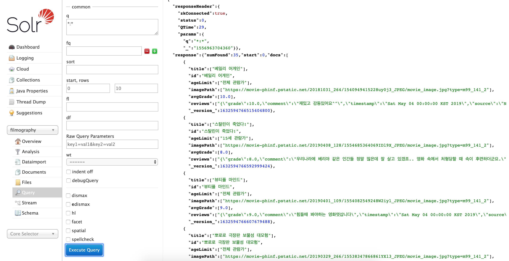

<p align="right">
 <a href="https://lucene.apache.org/solr/guide/7_6/"></a>
 <a href="https://spark.apache.org/releases/spark-release-2-1-0.html"></a>
</p>

<br>
<h1 align="center">Filmography</h1>
<p align="center">A simple search engine for searching running films in Korea.</p>
<br>

### Introduction
This application is a simple search engine for searching running films in Korea.
The word 'simple' means that It is only run on the local machine for now based on a purpose that understanding how solr search engine works.

<br>

### Getting started
This is a way to start quickly in your local.
```
git clone https://github.com/doubleknd26/filmography.git
cd filmography
./start.sh -b

...

[main] INFO  com.doubleknd26.filmography.indexer.FilmographyIndexer - *** Started Filmography indexer.
[Executor task launch worker-0] INFO  com.doubleknd26.filmography.indexer.solr.SolrClientWrapper - collection filmography is created. 
[main] INFO  com.doubleknd26.filmography.indexer.FilmographyIndexer - *** Indexed doc count: 35
[main] INFO  com.doubleknd26.filmography.indexer.FilmographyIndexer - *** Unindexed doc count: 0
[main] INFO  com.doubleknd26.filmography.indexer.FilmographyIndexer - *** Filmography is ready to search. Let's search using Solr.
[main] INFO  com.doubleknd26.filmography.indexer.FilmographyIndexer - *** please visit: http://localhost:8983/solr/#/filmography/query
```

Visit [here](http://localhost:8983/solr/#/filmography/query) to see below solr admin. You can click **Execute Query** button to see default search result.
 

Execute below command to stop filmography gracefully.
```
cd filmography
./stop.sh
Sending stop command to Solr running on port 8983 ... waiting up to 180 seconds to allow Jetty process 70232 to stop gracefully.
```

<br>

### Components
- **Apache Solr Cloud**: run solr cloud on the local machine.
- **Crawler**: crawls websites to get running film information.
- **Transformer**: transform crawled dataset to index document.
- **Loader**: Load index document to solr cloud.

